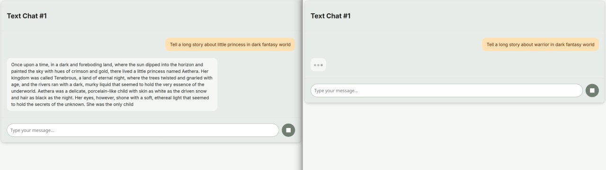

# LLM Chat System with Queue

**Full-stack implementation for LLM chat with RabbitMQ queue system**  
*Purpose: scalable solution for deploying multiple LLM agents across machines*

The project utilizes RabbitMQ to create a queue for LLM completions, allowing for scaling the number of LLM instances and utilizing resources from different machines.
The client interface is a React application that currently operates via WebSocket, enabling instant queue placement and receiving results as soon as the next LLM instance becomes available. The server allows clients to connect via WebSocket and maintain the connection.
At the moment, each chat session is unique, and its context exists only in the server's memory.
The LLM leverages llama.cpp through bindings. This approach was primarily chosen for research purposes to gain a deeper understanding of the internal workings of LLM implementations.



*Demonstration of the queue in action with a single running LLM instance. When two clients are connected, one of them will wait for their turn.*

## TODO
- [x] Apply template to chat messages from llm model if possible
- [ ] Implement chat context persistence using a database  
- [ ] Add Create/Delete/Restore functionality for chats using a unique ID from long-term storage  
- [ ] Enable real-time editing of LLM parameters (system prompt, template, temperature, etc.)  
- [ ] Optimize context storage using Redis  
- [ ] Improve error handling and logging  
- [ ] Provide a REST API for completions as an alternative to WebSocket  
- [ ] Develop a Telegram bot that interacts with the server  
- [ ] Implement simple user authentication

## Quick Start Guide

### Prerequisites
- Linux environment
- Docker installed
- LLM model files (GGUF format requred)

---

### Setup

1. **Clone Repository**

2. **Update submodule**
   ```bash
   git submodule update --init --recursive
   ```

2. **Configure Docker**  
   Edit `fullstack-compose.yaml`:
   ```yaml
   services:
     llm:
       volumes:
         - /path/to/your/models:/app/models  # Mount model directory
       environment:
         - MODEL_PATH=/app/models/your_model.gguf  # Specify model filename
   ```

3. **Launch System**
   ```bash
   docker compose -f fullstack-compose.yaml up --build -d
   ```

---

### Access Interface
Open `http://localhost:5000` in your browser

---

## License

MIT License